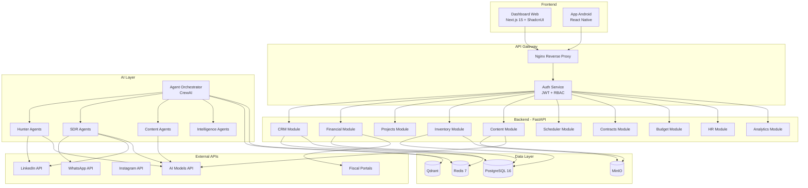

# SOMOS PRODUTORA — Sistema Integrado de Gestão Inteligente

> Transformando quase 30 anos de excelência audiovisual em uma operação 100% digital, inteligente e escalável.

---

## 🎯 Visão do Projeto

O **Sistema Somos** é uma plataforma integrada que unifica toda a operação da Somos Produtora — desde a prospecção de clientes até a entrega final de projetos — em um único ecossistema digital potencializado por **Inteligência Artificial**. Agentes de IA atuam como funcionários digitais dedicados, trabalhando 24/7 para encontrar oportunidades, qualificar leads, gerar conteúdo e otimizar processos, enquanto a equipe humana foca no que faz de melhor: criar comunicação audiovisual de impacto.

---

## 💡 O Problema que Resolvemos

A Somos Produtora, com quase três décadas de mercado, enfrenta desafios operacionais que limitam seu crescimento:

| Dor | Impacto | Solução |
|-----|---------|---------|
| **Prospecção manual** | Horas perdidas filtrando leads em LinkedIn, Instagram, Google | Agentes Hunter IA buscando 24/7 em múltiplas plataformas |
| **Outreach fragmentado** | Mensagens espalhadas entre WhatsApp, email, redes sociais | SDR automatizado com sequências inteligentes |
| **Sem CRM centralizado** | Informações de clientes dispersas, sem funil visual | Pipeline Kanban integrado com histórico completo |
| **Orçamentos manuais** | Tempo excessivo montando propostas, buscando preços | Gerador inteligente com inventário e tabela de preços |
| **Controle financeiro limitado** | Sem visão clara de margens, impostos, comissões | ERP completo com dashboards visuais |
| **Gestão de equipamentos** | Sem controle de disponibilidade e manutenção | Inventário digital com tracking em tempo real |
| **Conteúdo para clientes** | Produção manual de posts, artigos, imagens | Content Studio com IA gerando conteúdo automaticamente |
| **Sem gestão de projetos** | Tarefas e entregas sem acompanhamento estruturado | Sistema de cards, sprints e status reports |

---

## 🚀 A Solução

Uma plataforma **all-in-one** que integra CRM, ERP, gestão de projetos, geração de conteúdo por IA e app mobile em um único sistema:

```
┌─────────────────────────────────────────────────────────────────┐
│                    SISTEMA SOMOS PRODUTORA                       │
├─────────────┬──────────────┬──────────────┬────────────────────┤
│  COMERCIAL  │  OPERAÇÕES   │  CONTEÚDO    │  ADMINISTRAÇÃO     │
├─────────────┼──────────────┼──────────────┼────────────────────┤
│ Hunter IA   │ Gest. Proj.  │ Content      │ Financeiro/ERP     │
│ SDR Auto    │ Contratos    │ Studio       │ Inventário         │
│ CRM Pipe    │ Orçamento    │ Social       │ Fornecedores       │
│ Pipeline    │ Inteligente  │ Scheduler    │ RH & Agentes       │
├─────────────┴──────────────┴──────────────┴────────────────────┤
│            Intelligence Feed  ·  Analytics & Reports            │
├─────────────────────────────────────────────────────────────────┤
│                      App Android (Mobile)                       │
└─────────────────────────────────────────────────────────────────┘
```

---

## 🧠 Inteligência Artificial no Centro

Os agentes de IA são o diferencial competitivo do sistema. Cada agente é um **funcionário digital** com persona, objetivos e ferramentas específicas:

### Time Comercial Digital
| Agente | Função | Modelo IA |
|--------|--------|-----------|
| **Hunter LinkedIn** | Busca leads por segmento no LinkedIn | Claude 3.5 Sonnet |
| **Hunter Google** | Pesquisa empresas e sites via Google/SerpAPI | GPT-4o |
| **Hunter Social** | Monitora Instagram, Facebook, YouTube | Claude 3.5 Sonnet |
| **SDR WhatsApp** | Envia mensagens personalizadas via WhatsApp | Claude 3.5 Sonnet |
| **SDR LinkedIn** | Convites e mensagens no LinkedIn | Claude 3.5 Sonnet |
| **SDR Email** | Outreach por email com personalização | GPT-4o |
| **Qualificador** | Pontua e qualifica leads por respostas | Claude 3.5 Sonnet |

### Time de Conteúdo Digital
| Agente | Função | Modelo IA |
|--------|--------|-----------|
| **Content Writer** | Textos para redes sociais e artigos | Claude 3.5 Sonnet |
| **Image Creator** | Imagens seguindo padrões da marca | DALL-E 3 / Flux |
| **News Curator** | Curadoria de notícias do setor | Gemini Pro |
| **Trend Analyzer** | Identifica oportunidades de mercado | Claude 3.5 Sonnet |

### Time de Suporte Digital
| Agente | Função | Modelo IA |
|--------|--------|-----------|
| **Budget Calculator** | Auxilia na construção de orçamentos | GPT-4o |
| **Contract Drafter** | Gera minutas de contratos | Claude 3.5 Sonnet |
| **Performance Evaluator** | Monitora KPIs dos agentes | Gemini Pro |
| **Report Generator** | Cria relatórios automatizados | GPT-4o |

> Quando um agente acumula falhas, ele é **desativado e substituído** por uma versão melhorada, incorporando as lições aprendidas. O time digital nunca para.

---

## 🏗️ Arquitetura do Sistema



---

## 📦 Módulos do Sistema

### 1. Hunter Intelligence
Agentes de IA que buscam proativamente potenciais clientes em LinkedIn, Google, Instagram, Facebook e YouTube, segmentados por nicho (farmacêutica, automotiva, moda, influenciadores, etc.).

### 2. SDR Automation
Agentes que abordam leads qualificados automaticamente via WhatsApp, LinkedIn, Instagram e email, com mensagens personalizadas e sequências de follow-up.

### 3. CRM Pipeline
Funil comercial visual em Kanban com todas as etapas: Descoberto → Contatado → Qualificado → Reunião Agendada → Proposta → Negociação → Fechado.

### 4. Gestão de Contratos
Geração automatizada de contratos a partir dos dados do CRM, com templates, campos variáveis, controle de versão e assinatura digital.

### 5. Gestão de Projetos
Cards de tarefas, sprints e status reports por cliente/projeto. Suporte a diferentes tipos: vídeos institucionais, gestão de redes sociais, cursos online, eventos.

### 6. Financeiro & ERP
Contas a pagar/receber, emissão de notas fiscais, cálculo de margens, comissões, impostos. Dashboards visuais com gráficos de pizza, barras e linhas.

### 7. Inventário
Cadastro e controle de todos os equipamentos (câmeras, lentes, iluminação, áudio, drones), com disponibilidade em tempo real, status de locação e manutenção.

### 8. Base de Fornecedores
Banco de dados de freelancers, equipamentos externos e serviços terceirizados, com tabelas de preço, disponibilidade e avaliações.

### 9. Orçamento Inteligente
Gerador de orçamentos que puxa automaticamente do inventário e banco de fornecedores, calcula custos, margens e gera PDF profissional.

### 10. Content Studio
Estúdio de criação com IA: curadoria de notícias, geração de textos, criação de imagens, montagem de carrosséis, artigos para LinkedIn — tudo seguindo a identidade visual do cliente.

### 11. Social Scheduler
Agendamento e publicação de conteúdo em Instagram, Facebook, LinkedIn e YouTube, com calendário visual por cliente e analytics integrado.

### 12. RH & Agentes
Gestão unificada de funcionários humanos e agentes de IA: metas, avaliações, classificação de falhas, substituição e melhoria contínua dos agentes.

### 13. Intelligence Feed
Agentes que monitoram constantemente tendências de mercado, oportunidades no setor audiovisual e comunicação, gerando alertas e relatórios.

### 14. Analytics & Reports
Dashboards executivos com KPIs de todos os módulos: leads, conversão, receita, performance de agentes, projetos ativos, saúde financeira.

### 15. App Android
Aplicativo mobile para clientes (acompanhar projetos, aprovar entregas) e equipe (gerenciar tarefas, receber notificações push, acessar dashboards).

---

## 🛠️ Tecnologias

| Camada | Tecnologia | Justificativa |
|--------|-----------|---------------|
| **Backend** | Python 3.12 + FastAPI | Async nativo, integração com libs de IA, tipagem, docs automáticas |
| **Frontend** | Next.js 15 + TypeScript + Tailwind + ShadcnUI | SSR/SSG, componentes modernos, DX excelente |
| **Mobile** | React Native + Expo | Compartilhamento de código TypeScript, único codebase |
| **DB Relacional** | PostgreSQL 16 | Robusto, JSONB, full-text search, extensões |
| **Cache/Filas** | Redis 7 | Sessões, cache, filas de tarefas (Bull), pub/sub |
| **DB Vetorial** | Qdrant | Busca semântica para agentes IA, embeddings |
| **Arquivos** | MinIO | S3-compatible, self-hosted, ideal para mídia |
| **AI Framework** | CrewAI + LangChain | Orquestração de agentes, ferramentas, memória |
| **AI Models** | Claude 3.5, GPT-4o, Gemini, DALL-E 3, Flux | Melhor modelo para cada tarefa |
| **Infra** | Docker + Nginx + Ubuntu 22.04 | Containerização, reverse proxy, estabilidade |
| **CI/CD** | GitHub Actions | Automação de lint, teste, build e deploy |
| **Monitoramento** | Grafana + Prometheus + Sentry | Métricas, dashboards, tracking de erros |

---

## 🤖 Ecossistema de Agentes

Os agentes de IA funcionam como um **time de funcionários digitais** da Somos Produtora:

- **15+ agentes especializados** trabalhando 24/7
- **Memória persistente** via banco vetorial (Qdrant) — cada agente lembra interações anteriores
- **Avaliação contínua** — KPIs monitorados, agentes com falhas são substituídos por versões melhoradas
- **Orquestração inteligente** — CrewAI coordena os agentes, delegando tarefas e gerenciando dependências
- **Segurança** — rate limits, auditoria de ações, aprovação humana para ações críticas
- **Custo otimizado** — modelo certo para cada tarefa (Claude para raciocínio complexo, GPT-4o para tarefas gerais, Gemini para análise)

---

## 📱 App Android

O aplicativo mobile oferece acesso ao ecossistema Somos de qualquer lugar:

**Para Clientes:**
- Acompanhar status do projeto em tempo real
- Aprovar entregas e materiais
- Visualizar cronograma e próximos passos
- Chat direto com a equipe

**Para a Equipe:**
- Gerenciar tarefas e atualizar status
- Receber notificações push de novos leads, tarefas e alertas
- Acessar dashboards e KPIs
- Comunicação interna

---

## 📈 Resultados Esperados

| Métrica | Antes | Depois | Impacto |
|---------|-------|--------|---------|
| Leads descobertos/mês | ~50 (manual) | 500+ (IA) | **+900%** |
| Tempo de prospecção | 6h/dia | 0h (automático) | **-100%** |
| Taxa de qualificação | ~5% | 15-25% | **+300%** |
| Tempo para orçamento | 2-3 horas | 15 minutos | **-88%** |
| Tempo para contrato | 1-2 dias | 5 minutos | **-99%** |
| Posts gerados/semana | 5-10 (manual) | 50+ (IA) | **+500%** |
| Controle financeiro | Planilhas | Dashboard real-time | **Total** |
| Gestão de equipamentos | Caderno/memória | Sistema digital | **Total** |

**ROI estimado:** Payback em **2-3 meses**, com economia equivalente a 3-5 funcionários comerciais.

---

## 🗓️ Roadmap de 10 Dias

```
Day 0  ████████████ Setup & Infraestrutura (Docker, DB, Auth, CI/CD)
Day 1  ████████████ CRM Pipeline (Deals, Contacts, Kanban)
Day 2  ████████████ Users, Roles, Permissions, Dashboard
Day 3  ████████████ Contratos, PDF Generator, Financeiro Base
Day 4  ████████████ Hunter Intelligence (Agentes de Prospecção)
Day 5  ████████████ SDR Automation (Agentes de Outreach)
Day 6  ████████████ CRM + AI Integration, Lead Scoring
Day 7  ████████████ Financial ERP, Inventário
Day 8  ████████████ Fornecedores, Orçamento Inteligente, Projetos
Day 9  ████████████ Content Studio, Social Scheduler
Day 10 ████████████ App Android, Analytics, Integração Final
```

---

## 💰 Modelo de Custos

| Item | Custo |
|------|-------|
| **Desenvolvimento (10 dias)** | R$ 45.000 - R$ 65.000 |
| **Infraestrutura mensal** | R$ 280 - R$ 430/mês |
| **APIs de IA mensal** | R$ 1.750 - R$ 3.250/mês |
| **Ferramentas e serviços** | R$ 100 - R$ 200/mês |
| **Total operacional mensal** | R$ 2.130 - R$ 3.880/mês |

**Economia mensal estimada:** R$ 15.000 - R$ 25.000 (equivalente a 3-5 salários comerciais)

---

## 🏢 Sobre o Desenvolvedor

**Zhuhai Kameda Technology Co., Ltd.**

Empresa de tecnologia especializada no desenvolvimento de sistemas inteligentes, plataformas SaaS e soluções com Inteligência Artificial. Com expertise em arquitetura de sistemas escaláveis e integração de agentes de IA para automação empresarial.

---

## 📞 Contato

- **Email:** contato@kameda.com.br
- **Site:** www.kameda.com.br
- **Empresa:** Zhuhai Kameda Technology Co., Ltd.
- **GitHub:** [nhkameda](https://github.com/nhkameda)

---

## 📁 Documentação Completa

| Documento | Descrição |
|-----------|-----------|
| [01 - Análise do Escopo](docs/01-analise-escopo.md) | Mapeamento completo das dores e requisitos |
| [02 - Arquitetura do Sistema](docs/02-arquitetura-sistema.md) | Arquitetura técnica detalhada |
| [03 - Árvore de Documentação](docs/03-arvore-documentacao.md) | Estrutura completa do projeto |
| [04 - Módulos Detalhados](docs/04-modulos-detalhados/) | Documentação de cada um dos 15 módulos |
| [05 - Stack Tecnológica](docs/05-stack-tecnologica.md) | Tecnologias e justificativas |
| [06 - Infraestrutura](docs/06-infraestrutura.md) | Configuração de servidores e deploy |
| [07 - Agentes de IA](docs/07-agentes-ia.md) | Catálogo completo de agentes |
| [08 - Integrações](docs/08-integracoes.md) | Mapa de APIs e serviços externos |
| [09 - Banco de Dados](docs/09-banco-dados.md) | Modelo de dados e schemas |
| [10 - Segurança](docs/10-seguranca.md) | Autenticação, RBAC, LGPD |
| [11 - Roadmap](docs/11-roadmap-implementacao.md) | Plano de implementação em 10 dias |
| [12 - Estimativa de Custos](docs/12-estimativa-custos.md) | Custos de desenvolvimento e operação |
| [13 - Métricas de Sucesso](docs/13-metricas-sucesso.md) | KPIs e metas pós-implantação |

---

*Desenvolvido por **Zhuhai Kameda Technology Co., Ltd.** — Fevereiro 2026*
*Planejamento assistido por Claude Code (Anthropic)*
