# 02 — Arquitetura do Sistema

> **Somos Produtora** — Sistema Integrado de Gestao Comercial e Operacional com IA
> Versao: 1.0 | Ultima atualizacao: 2026-02-28

---

## Indice

1. [2.1 — Arquitetura Geral](#21--arquitetura-geral)
2. [2.2 — Mapa dos 15 Modulos](#22--mapa-dos-15-modulos)
3. [2.3 — Infraestrutura Linux](#23--infraestrutura-linux)
4. [2.4 — Ecossistema de IA](#24--ecossistema-de-ia)
5. [2.5 — Integracoes Externas](#25--integracoes-externas)

---

## 2.1 — Arquitetura Geral

### Filosofia Arquitetural

A plataforma Somos Produtora adota uma estrategia de evolucao progressiva em duas fases, minimizando risco na entrega inicial e viabilizando escalabilidade futura sem reescritas completas.

| Aspecto | Fase 1 (MVP) | Fase 2 (Evolucao) |
|---------|-------------|-------------------|
| **Padrao** | Monolito Modular | Microsservicos |
| **Deploy** | Docker Compose (unico servidor) | Docker Swarm / Kubernetes |
| **Comunicacao** | Chamadas internas em processo | Event bus (Redis Streams / RabbitMQ) |
| **Banco** | PostgreSQL compartilhado (schemas separados) | Banco por servico (database-per-service) |
| **Timeline** | Dias 0-10 (implementacao inicial) | Meses 3-6 (apos validacao) |

### Fase 1 — Monolito Modular

O backend e construido como um **unico processo FastAPI** com separacao logica rigorosa entre modulos. Cada modulo possui seu proprio diretorio com models, schemas, services e routers, garantindo fronteiras claras que facilitam a futura extracao em microsservicos.

**Principios do Monolito Modular:**

1. **Isolamento de dominio**: Cada modulo encapsula sua propria logica de negocio e nao acessa diretamente models de outros modulos
2. **Comunicacao via services**: Modulos interagem atraves de interfaces de servico (service layer), nunca acessando tabelas alheias diretamente
3. **Events internos**: Eventos de dominio (domain events) sao disparados via um event bus interno (em memoria na Fase 1, Redis na Fase 2)
4. **Migrations independentes**: Alembic configurado com branches por modulo para evitar conflitos

```
backend/
├── app/
│   ├── main.py                    # Ponto de entrada — registra routers de todos os modulos
│   ├── config.py                  # Pydantic Settings — variaveis de ambiente
│   ├── database.py                # Engine async SQLAlchemy + session factory
│   ├── events.py                  # Event bus interno (in-process → Redis na Fase 2)
│   ├── core/
│   │   ├── security.py            # JWT, hashing, RBAC middleware
│   │   ├── middleware.py          # CORS, rate limiting, request logging
│   │   ├── exceptions.py         # Exception handlers padronizados
│   │   └── permissions.py        # Decorators de permissao por role
│   ├── modules/
│   │   ├── hunter/               # Modulo 1: Hunter Intelligence
│   │   ├── sdr/                  # Modulo 2: SDR Automation
│   │   ├── crm/                  # Modulo 3: CRM Pipeline
│   │   ├── contracts/            # Modulo 4: Gestao de Contratos
│   │   ├── projects/             # Modulo 5: Gestao de Projetos
│   │   ├── finance/              # Modulo 6: Financeiro/ERP
│   │   ├── inventory/            # Modulo 7: Inventario
│   │   ├── suppliers/            # Modulo 8: Fornecedores
│   │   ├── budgets/              # Modulo 9: Orcamento Inteligente
│   │   ├── content/              # Modulo 10: Content Studio
│   │   ├── social/               # Modulo 11: Social Scheduler
│   │   ├── hr/                   # Modulo 12: RH & Agentes
│   │   ├── intelligence/         # Modulo 13: Intelligence Feed
│   │   └── analytics/            # Modulo 14: Analytics & Reports
│   ├── agents/                   # Agentes CrewAI/LangChain
│   ├── integrations/             # Conectores com APIs externas
│   └── utils/                    # Helpers compartilhados
```

### Fase 2 — Microsservicos (Event-Driven)

Na Fase 2, modulos com carga ou complexidade elevada sao extraidos como servicos independentes. A comunicacao migra para um padrao **Event-Driven** baseado em Redis Streams (ou RabbitMQ), onde cada servico publica e consome eventos de dominio sem acoplamento direto.

**Candidatos prioritarios a extracao:**

| Servico | Motivo da Extracao | Comunicacao |
|---------|--------------------|-------------|
| **Agents Service** | Alta carga de CPU/tokens, execucao longa | Celery tasks + Redis events |
| **Content Service** | Processamento de midia pesado | Redis Streams (async) |
| **Analytics Service** | Queries pesadas, nao deve impactar API principal | Event sourcing + CQRS |
| **Notification Service** | WhatsApp, email, push — independente do core | Redis Pub/Sub |

### Stack Tecnologica Resumida

| Camada | Tecnologia | Versao |
|--------|-----------|--------|
| **Backend** | Python + FastAPI | 3.12 / 0.110+ |
| **Frontend** | Next.js + TypeScript + Tailwind + ShadcnUI | 15 / 5.4+ / 3.4+ |
| **Mobile** | React Native + Expo | 0.73+ / SDK 50+ |
| **DB Relacional** | PostgreSQL | 16 |
| **Cache / Broker** | Redis | 7 |
| **DB Vetorial** | Qdrant | 1.8+ |
| **Object Storage** | MinIO (S3-compatible) | 2024+ |
| **Reverse Proxy** | Nginx + Let's Encrypt | Alpine |
| **Containers** | Docker + Docker Compose | 25+ / 2.24+ |
| **CI/CD** | GitHub Actions | - |
| **Monitoramento** | Prometheus + Grafana + Sentry + Loki | - |

### Autenticacao e Autorizacao — JWT + RBAC

O sistema implementa autenticacao via **JSON Web Tokens (JWT)** com refresh token rotation e controle de acesso baseado em papeis (**RBAC** — Role-Based Access Control) com 5 niveis de permissao.

| Role | Codigo | Descricao | Acesso |
|------|--------|-----------|--------|
| **Administrador** | `Admin` | Proprietario / gerente geral do sistema | Total — todos os modulos, configuracoes, usuarios, financeiro |
| **Diretor Comercial** | `Diretor` | Responsavel pela area comercial e projetos | CRM, Deals, Projetos, Contratos, Orcamentos, Analytics |
| **Comercial** | `Comercial` | Vendedor / SDR humano | Leads, Deals (proprio pipeline), Contatos, Orcamentos (criacao) |
| **Agente IA** | `Agente_IA` | Conta de servico para agentes autonomos | Endpoints especificos via API key, rate limited, auditado |
| **Cliente** | `Cliente` | Portal do cliente (acesso externo limitado) | Visualizar seus projetos, contratos, faturas; aprovar conteudo |

**Fluxo de Autenticacao:**


**Matriz de Permissoes por Modulo:**

```
              Admin  Diretor  Comercial  Agente_IA  Cliente
Hunter         RW      RW        R          RW         -
SDR            RW      RW        R          RW         -
CRM            RW      RW        RW*        R          -
Contratos      RW      RW        R          -          R
Projetos       RW      RW        R          -          R
Financeiro     RW      R         -          -          R*
Inventario     RW      RW        R          -          -
Fornecedores   RW      RW        R          -          -
Orcamentos     RW      RW        RW         RW         R
Content Studio RW      RW        R          RW         R*
Social Sched.  RW      RW        R          RW         -
RH & Agentes   RW      R         -          -          -
Intel Feed     RW      RW        R          RW         -
Analytics      RW      RW        R          R          R*
App Android    RW      RW        RW         -          RW

R  = Leitura    RW = Leitura + Escrita    - = Sem acesso
*  = Acesso restrito ao proprio escopo (ex: Comercial ve apenas seus deals)
R* = Leitura parcial (ex: Cliente ve apenas suas faturas)
```

### Diagrama de Componentes — Visao Geral

```mermaid
graph TB
    subgraph Clientes["Camada de Clientes"]
        Browser["🖥 Browser<br/>(Next.js Dashboard)"]
        Mobile["📱 App Android<br/>(React Native)"]
        WhatsAppUser["💬 WhatsApp<br/>(Clientes/Leads)"]
    end

    subgraph EdgeLayer["Camada de Borda"]
        CF["Cloudflare<br/>DNS + CDN + DDoS"]
        Nginx["Nginx<br/>Reverse Proxy<br/>SSL Termination<br/>Rate Limiting"]
    end

    subgraph ApplicationLayer["Camada de Aplicacao"]
        Frontend["Next.js 15<br/>SSR/SSG<br/>Port 3000"]
        Backend["FastAPI<br/>REST + WebSocket<br/>Port 8000"]
        CeleryWorker["Celery Workers<br/>(4 workers)<br/>Tasks + Agentes IA"]
        CeleryBeat["Celery Beat<br/>Scheduler"]
    end

    subgraph DataLayer["Camada de Dados"]
        PG["PostgreSQL 16<br/>Dados Relacionais<br/>Port 5432"]
        Redis["Redis 7<br/>Cache + Broker + Sessions<br/>Port 6379"]
        Qdrant["Qdrant<br/>Embeddings Vetoriais<br/>Port 6333"]
        MinIO["MinIO<br/>Object Storage (S3)<br/>Port 9000"]
    end

    subgraph AILayer["Camada de IA"]
        CrewAI["CrewAI<br/>Orquestracao Multi-Agente"]
        LangChain["LangChain<br/>Tools + Chains + Memory"]
    end

    subgraph ExternalAPIs["APIs Externas"]
        Anthropic["Anthropic<br/>Claude 3.5 Sonnet"]
        OpenAI["OpenAI<br/>GPT-4o + DALL-E 3"]
        Google["Google AI<br/>Gemini Pro"]
        WhatsAppAPI["Evolution API<br/>WhatsApp"]
        LinkedIn["LinkedIn API"]
        SerpAPI["SerpAPI"]
        Asaas["Asaas<br/>Pagamentos"]
        Resend["Resend<br/>Email"]
    end

    subgraph Monitoring["Monitoramento"]
        Prometheus["Prometheus"]
        Grafana["Grafana"]
        Sentry["Sentry"]
        Loki["Loki<br/>Logs"]
    end

    Browser --> CF
    Mobile --> CF
    CF --> Nginx
    WhatsAppUser --> WhatsAppAPI

    Nginx --> Frontend
    Nginx --> Backend
    Nginx --> MinIO

    Backend --> PG
    Backend --> Redis
    Backend --> Qdrant
    Backend --> MinIO
    Backend --> CeleryWorker

    CeleryBeat --> Redis
    CeleryWorker --> Redis
    CeleryWorker --> PG

    CeleryWorker --> CrewAI
    CrewAI --> LangChain

    LangChain --> Anthropic
    LangChain --> OpenAI
    LangChain --> Google

    Backend --> WhatsAppAPI
    Backend --> LinkedIn
    Backend --> SerpAPI
    Backend --> Asaas
    Backend --> Resend

    Backend --> Prometheus
    Backend --> Sentry
    Prometheus --> Grafana
    Loki --> Grafana
```



### Diagrama de Fluxo de Dados — Request Lifecycle


### Padroes de Comunicacao

O sistema utiliza quatro padroes de comunicacao distintos, cada um otimizado para seu caso de uso:

| Padrao | Tecnologia | Uso | Latencia |
|--------|-----------|-----|----------|
| **Request/Response** | REST (HTTP/JSON) | CRUD, consultas, operacoes sincronas | < 200ms |
| **Real-time Push** | WebSocket | Notificacoes, atualizacoes de status, chat | < 50ms |
| **Async Tasks** | Celery + Redis | Agentes IA, processamento de midia, relatorios | Segundos a minutos |
| **Scheduled Jobs** | Celery Beat | Backup, scraping agendado, envio de reports diarios | Cron-based |

### Event-Driven Architecture para Agentes IA

Os agentes de IA operam em um modelo event-driven que desacopla a solicitacao do processamento:


---

## 2.2 — Mapa dos 15 Modulos

### Visao Geral dos Modulos e Interdependencias

O sistema e composto por **15 modulos** organizados em 4 dominios funcionais. Cada modulo encapsula uma responsabilidade de negocio especifica e se comunica com outros modulos atraves de interfaces bem definidas.


### Modulo 1 — Hunter Intelligence

| Atributo | Detalhe |
|----------|---------|
| **Responsabilidade** | Prospeccao ativa e automatizada de leads potenciais usando agentes de IA |
| **Fontes de Dados** | LinkedIn, Google Search, Google Maps, redes sociais, diretorios empresariais |
| **Agentes IA** | Hunter LinkedIn, Hunter Google, Hunter Social, Qualificador |
| **Entradas** | ICP (Ideal Customer Profile) definido pelo Diretor Comercial |
| **Saidas** | Lista de leads enriquecidos com score de qualificacao (0-100) |
| **Tabelas** | `leads`, `lead_sources`, `lead_scores`, `icp_profiles`, `search_sessions` |
| **Integ. Externas** | SerpAPI, LinkedIn API, Google Custom Search |
| **Dependencias** | Qdrant (busca semantica), Redis (cache de resultados) |

### Modulo 2 — SDR Automation

| Atributo | Detalhe |
|----------|---------|
| **Responsabilidade** | Abordagem automatizada multicanal de leads qualificados pelo Hunter |
| **Canais** | WhatsApp (Evolution API), LinkedIn InMail, Email (Resend) |
| **Agentes IA** | SDR WhatsApp, SDR LinkedIn, SDR Email |
| **Entradas** | Leads qualificados (score >= 70) do modulo Hunter |
| **Saidas** | Leads aceitos movidos para o CRM; metricas de resposta |
| **Tabelas** | `outreach_campaigns`, `outreach_messages`, `cadences`, `responses` |
| **Integ. Externas** | Evolution API (WhatsApp), LinkedIn API, Resend (email) |
| **Dependencias** | Modulo 1 (Hunter), Modulo 3 (CRM para leads aceitos) |

### Modulo 3 — CRM Pipeline

| Atributo | Detalhe |
|----------|---------|
| **Responsabilidade** | Gestao completa do funil de vendas com board Kanban e automacoes |
| **Funcionalidades** | Pipeline visual, contatos, empresas, deals, atividades, tags |
| **Interface** | Board Kanban (drag-and-drop), listagens com filtros, timeline |
| **Entradas** | Leads aceitos do SDR; contatos/empresas criados manualmente |
| **Saidas** | Deals fechados encaminhados para Contratos e Projetos |
| **Tabelas** | `contacts`, `companies`, `deals`, `deal_stages`, `deal_activities`, `tags` |
| **Integ. Externas** | Nenhuma direta (alimentado pelos modulos Hunter e SDR) |
| **Dependencias** | Modulo 2 (SDR), Modulo 4 (Contratos), Modulo 9 (Orcamentos) |

### Modulo 4 — Gestao de Contratos

| Atributo | Detalhe |
|----------|---------|
| **Responsabilidade** | Criacao, gestao de ciclo de vida e assinatura digital de contratos |
| **Funcionalidades** | Templates com variaveis, geracao PDF, versionamento, alertas de vencimento |
| **Agentes IA** | Contract Drafter (geracao de clausulas via Claude) |
| **Entradas** | Deal fechado no CRM; dados do cliente e escopo do projeto |
| **Saidas** | Contrato assinado que inicia Projeto e gera receita no Financeiro |
| **Tabelas** | `contracts`, `contract_templates`, `contract_versions`, `contract_signatures` |
| **Integ. Externas** | MinIO (armazenamento PDF), Asaas (vinculacao com cobranca) |
| **Dependencias** | Modulo 3 (CRM), Modulo 5 (Projetos), Modulo 6 (Financeiro) |

### Modulo 5 — Gestao de Projetos

| Atributo | Detalhe |
|----------|---------|
| **Responsabilidade** | Gerenciamento de projetos de producao audiovisual com tarefas e timelines |
| **Funcionalidades** | Board de tarefas, Gantt simplificado, alocacao de equipe/equipamentos, milestones |
| **Interface** | Board Kanban de tarefas, calendario de producao, timeline de entregas |
| **Entradas** | Contrato assinado com escopo de projeto definido |
| **Saidas** | Custos de producao para o Financeiro; demandas de equipe para RH |
| **Tabelas** | `projects`, `tasks`, `task_assignments`, `milestones`, `project_timelines` |
| **Integ. Externas** | Google Calendar (sincronizacao de agenda) |
| **Dependencias** | Modulo 4 (Contratos), Modulo 7 (Inventario), Modulo 8 (Fornecedores), Modulo 12 (RH) |

### Modulo 6 — Financeiro / ERP

| Atributo | Detalhe |
|----------|---------|
| **Responsabilidade** | Controle financeiro completo — contas a pagar/receber, NF-e, fluxo de caixa, DRE |
| **Funcionalidades** | Faturamento, cobrancas, conciliacao bancaria, emissao de NF-e, relatorios fiscais |
| **Interface** | Dashboard financeiro, listagens de lancamentos, graficos de fluxo de caixa |
| **Entradas** | Receitas de contratos, custos de projetos, despesas com fornecedores |
| **Saidas** | Dados financeiros consolidados para Analytics; boletos/PIX para clientes |
| **Tabelas** | `invoices`, `payments`, `expenses`, `bank_transactions`, `tax_documents`, `financial_categories` |
| **Integ. Externas** | Asaas (cobrancas), PagSeguro (fallback), eNotas/Nuvem Fiscal (NF-e), Open Banking |
| **Dependencias** | Modulo 4 (Contratos), Modulo 5 (Projetos), Modulo 8 (Fornecedores) |

### Modulo 7 — Inventario

| Atributo | Detalhe |
|----------|---------|
| **Responsabilidade** | Controle de equipamentos e materiais de producao audiovisual |
| **Funcionalidades** | Cadastro de itens, rastreamento de status, agendamento de uso, historico |
| **Categorias** | Cameras, lentes, iluminacao, audio, acessorios, cenografia |
| **Entradas** | Compras/locacoes registradas, devolucoes de producao |
| **Saidas** | Disponibilidade para alocacao em projetos; custos de depreciacao |
| **Tabelas** | `inventory_items`, `inventory_categories`, `item_reservations`, `maintenance_logs` |
| **Integ. Externas** | MinIO (fotos dos equipamentos) |
| **Dependencias** | Modulo 5 (Projetos — alocacao), Modulo 6 (Financeiro — custos) |

### Modulo 8 — Fornecedores

| Atributo | Detalhe |
|----------|---------|
| **Responsabilidade** | Cadastro e avaliacao de fornecedores e prestadores de servico |
| **Funcionalidades** | Base de fornecedores, avaliacao de performance, comparativo de precos, historico |
| **Categorias** | Freelancers, locacao de equipamentos, pos-producao, graficas, locacoes |
| **Entradas** | Necessidades de projetos; feedback da equipe |
| **Saidas** | Contratacoes para projetos; despesas para o Financeiro |
| **Tabelas** | `suppliers`, `supplier_categories`, `supplier_evaluations`, `supplier_contracts` |
| **Integ. Externas** | Nenhuma direta |
| **Dependencias** | Modulo 5 (Projetos), Modulo 6 (Financeiro) |

### Modulo 9 — Orcamento Inteligente

| Atributo | Detalhe |
|----------|---------|
| **Responsabilidade** | Geracao automatizada de orcamentos com IA baseada em projetos anteriores |
| **Funcionalidades** | Analise de briefing, sugestao de composicao, calculo de custos, export PDF |
| **Agentes IA** | Budget Calculator (analisa briefing e gera estimativa com base em historico) |
| **Entradas** | Briefing do cliente (texto); dados do deal no CRM |
| **Saidas** | Orcamento detalhado para envio ao cliente; base para contrato |
| **Tabelas** | `budgets`, `budget_items`, `budget_templates`, `budget_versions` |
| **Integ. Externas** | MinIO (export PDF), Qdrant (busca de projetos similares) |
| **Dependencias** | Modulo 3 (CRM), Modulo 4 (Contratos), Modulo 7 (Inventario — custos de equipamento) |

### Modulo 10 — Content Studio

| Atributo | Detalhe |
|----------|---------|
| **Responsabilidade** | Plataforma de criacao de conteudo assistida por IA (textos e imagens) |
| **Funcionalidades** | Geracao de textos, geracao de imagens, editor visual, banco de assets, versionamento |
| **Agentes IA** | Content Writer (Claude/GPT-4o), Image Creator (DALL-E 3/Flux) |
| **Entradas** | Briefing criativo; calendario editorial; trends do Intelligence Feed |
| **Saidas** | Conteudo pronto para publicacao no Social Scheduler |
| **Tabelas** | `content_pieces`, `content_templates`, `assets`, `content_versions`, `content_approvals` |
| **Integ. Externas** | Anthropic (texto), OpenAI (texto/imagens), Replicate (Flux), Canva API |
| **Dependencias** | Modulo 11 (Social Scheduler), Modulo 13 (Intelligence Feed) |

### Modulo 11 — Social Scheduler

| Atributo | Detalhe |
|----------|---------|
| **Responsabilidade** | Agendamento e publicacao automatizada de conteudo em redes sociais |
| **Funcionalidades** | Calendario editorial, agendamento multi-plataforma, preview, analytics basico |
| **Plataformas** | Instagram, Facebook, LinkedIn, YouTube, TikTok |
| **Entradas** | Conteudo aprovado do Content Studio |
| **Saidas** | Posts publicados; metricas de engajamento para Analytics |
| **Tabelas** | `scheduled_posts`, `social_accounts`, `post_metrics`, `editorial_calendar` |
| **Integ. Externas** | Instagram Graph API, Facebook Graph API, LinkedIn API, YouTube Data API |
| **Dependencias** | Modulo 10 (Content Studio), Modulo 14 (Analytics) |

### Modulo 12 — RH & Agentes

| Atributo | Detalhe |
|----------|---------|
| **Responsabilidade** | Gestao de equipe interna, freelancers e monitoramento de agentes IA |
| **Funcionalidades** | Cadastro de profissionais, habilidades, disponibilidade, pagamentos, avaliacao |
| **Escopo Duplo** | Recursos humanos (equipe) + recursos de IA (agentes) em uma unica visao |
| **Entradas** | Necessidades de equipe dos projetos; metricas dos agentes IA |
| **Saidas** | Alocacao de equipe para projetos; custos de folha para Financeiro |
| **Tabelas** | `team_members`, `skills`, `availability`, `agent_metrics`, `performance_reviews` |
| **Integ. Externas** | Nenhuma direta |
| **Dependencias** | Modulo 5 (Projetos), Modulo 6 (Financeiro — folha de pagamento) |

### Modulo 13 — Intelligence Feed

| Atributo | Detalhe |
|----------|---------|
| **Responsabilidade** | Monitoramento e curadoria de noticias, tendencias e oportunidades de mercado |
| **Funcionalidades** | Agregacao de fontes, filtragem por IA, resumo automatico, alertas |
| **Agentes IA** | Trend Analyzer (Gemini Pro), News Curator (GPT-4o-mini) |
| **Entradas** | RSS feeds, APIs de noticias, Google Trends, dados de redes sociais |
| **Saidas** | Insights para Hunter (oportunidades), Content Studio (tendencias) |
| **Tabelas** | `news_items`, `trend_reports`, `intel_sources`, `intel_alerts` |
| **Integ. Externas** | SerpAPI (Google News), RSS feeds, Google Trends API |
| **Dependencias** | Modulo 1 (Hunter — insights), Modulo 10 (Content Studio — trends) |

### Modulo 14 — Analytics & Reports

| Atributo | Detalhe |
|----------|---------|
| **Responsabilidade** | Dashboard central de KPIs e geracao de relatorios consolidados |
| **Funcionalidades** | Dashboards interativos, relatorios customizados, export PDF/Excel, alertas |
| **Agentes IA** | Report Generator (analise automatica de dados e insights) |
| **Entradas** | Dados de todos os modulos do sistema |
| **Saidas** | Dashboards visuais, relatorios PDF, insights acionaveis |
| **Tabelas** | `reports`, `report_templates`, `dashboard_configs`, `kpi_snapshots` |
| **Integ. Externas** | MinIO (export de relatorios) |
| **Dependencias** | Todos os demais modulos (leitura de dados) |

### Modulo 15 — App Android

| Atributo | Detalhe |
|----------|---------|
| **Responsabilidade** | Acesso mobile as funcionalidades essenciais do sistema |
| **Funcionalidades** | Dashboard resumido, notificacoes push, aprovacoes rapidas, camera |
| **Plataforma** | Android (React Native + Expo), com possibilidade futura de iOS |
| **Entradas** | Mesma API backend (REST + WebSocket) |
| **Saidas** | Acoes rapidas (aprovar conteudo, mover deal, responder lead) |
| **Tecnologia** | React Native 0.73+, Expo SDK 50+, TypeScript, Zustand |
| **Integ. Externas** | Firebase Cloud Messaging (push), Expo Camera |
| **Dependencias** | Backend API (todos os modulos expostos via REST) |

### Tabela Resumo — Todos os Modulos

| # | Modulo | Dominio | Agentes IA | Integ. Externas | Prioridade |
|---|--------|---------|-----------|-----------------|------------|
| 1 | Hunter Intelligence | Comercial | Hunter LinkedIn, Hunter Google, Hunter Social, Qualificador | SerpAPI, LinkedIn, Google Search | P0 |
| 2 | SDR Automation | Comercial | SDR WhatsApp, SDR LinkedIn, SDR Email | Evolution API, LinkedIn, Resend | P0 |
| 3 | CRM Pipeline | Comercial | - | - | P0 |
| 4 | Gestao de Contratos | Comercial | Contract Drafter | MinIO | P1 |
| 5 | Gestao de Projetos | Operacional | - | Google Calendar | P1 |
| 6 | Financeiro / ERP | Gestao | - | Asaas, PagSeguro, NF-e APIs | P1 |
| 7 | Inventario | Operacional | - | MinIO | P2 |
| 8 | Fornecedores | Operacional | - | - | P2 |
| 9 | Orcamento Inteligente | Comercial | Budget Calculator | Qdrant, MinIO | P1 |
| 10 | Content Studio | Conteudo | Content Writer, Image Creator | Anthropic, OpenAI, Replicate, Canva | P1 |
| 11 | Social Scheduler | Conteudo | - | Instagram, Facebook, LinkedIn, YouTube | P1 |
| 12 | RH & Agentes | Operacional | - | - | P2 |
| 13 | Intelligence Feed | Conteudo | Trend Analyzer, News Curator | SerpAPI, RSS, Google Trends | P2 |
| 14 | Analytics & Reports | Gestao | Report Generator | MinIO | P1 |
| 15 | App Android | Gestao | - | Firebase (push) | P2 |

---

## 2.3 — Infraestrutura Linux

### Especificacao do Servidor

O sistema roda inteiramente em um unico servidor VPS com as seguintes especificacoes, suficientes para a operacao da Fase 1.

| Especificacao | Valor |
|---------------|-------|
| **Sistema Operacional** | Ubuntu 22.04 LTS (Jammy Jellyfish) |
| **Kernel** | 5.15+ com tuning para alto throughput |
| **vCPU** | 8 cores |
| **RAM** | 32 GB DDR4 |
| **Disco** | 500 GB NVMe SSD |
| **Banda** | 1 Gbps (20 TB/mes de transferencia) |
| **Localizacao** | Europa (Hetzner) com Cloudflare CDN na frente |

### Diagrama de Infraestrutura — Visao do Servidor


### Distribuicao de Recursos (32 GB RAM)

```
┌──────────────────────────────────────────────────────────────┐
│                    32 GB RAM — DISTRIBUICAO                    │
├──────────────────┬───────────┬────────────────────────────────┤
│ Servico          │ RAM       │ Barra Visual                   │
├──────────────────┼───────────┼────────────────────────────────┤
│ PostgreSQL 16    │ 8.0 GB    │ ████████████████               │
│ Qdrant           │ 4.0 GB    │ ████████                       │
│ FastAPI (4w)     │ 4.0 GB    │ ████████                       │
│ Celery (4w)      │ 4.0 GB    │ ████████                       │
│ SO + Docker      │ 3.5 GB    │ ███████                        │
│ Redis 7          │ 2.0 GB    │ ████                           │
│ Next.js (2i)     │ 2.0 GB    │ ████                           │
│ MinIO            │ 2.0 GB    │ ████                           │
│ Monitoramento    │ 2.0 GB    │ ████                           │
│ Nginx            │ 0.5 GB    │ █                              │
├──────────────────┼───────────┼────────────────────────────────┤
│ TOTAL            │ 32.0 GB   │ ████████████████████████████████│
└──────────────────┴───────────┴────────────────────────────────┘
```

### Docker Compose — Arquitetura de Containers

O sistema opera com **14 containers** Docker orquestrados via Docker Compose:

| Container | Imagem | Porta | Replicas | Funcao |
|-----------|--------|-------|----------|--------|
| `somos-nginx` | nginx:alpine | 80, 443 | 1 | Reverse proxy, SSL termination, rate limiting |
| `somos-frontend` | node:20-alpine + build | 3000 | 2 | Interface web SSR/SSG |
| `somos-backend` | python:3.12-slim + app | 8000 | 1 (4 workers) | API REST + WebSocket |
| `somos-celery-worker` | python:3.12-slim + app | - | 1 (4 workers) | Processamento em background + agentes IA |
| `somos-celery-beat` | python:3.12-slim + app | - | 1 | Agendador de tarefas periodicas |
| `somos-postgres` | postgres:16-alpine | 5432* | 1 | Banco de dados relacional |
| `somos-redis` | redis:7-alpine | 6379* | 1 | Cache, broker Celery, sessions |
| `somos-qdrant` | qdrant/qdrant:latest | 6333* | 1 | Banco de dados vetorial |
| `somos-minio` | minio/minio:latest | 9000*, 9001* | 1 | Object storage S3-compatible |
| `somos-prometheus` | prom/prometheus | 9090* | 1 | Coleta de metricas |
| `somos-grafana` | grafana/grafana | 3001* | 1 | Dashboards visuais |
| `somos-loki` | grafana/loki | 3100* | 1 | Agregacao de logs |
| `somos-node-exporter` | prom/node-exporter | 9100* | 1 | Metricas do sistema operacional |
| `somos-certbot` | certbot/certbot | - | 1 | Renovacao automatica de certificados SSL |

> *Portas marcadas com asterisco (`*`) estao expostas apenas em `127.0.0.1` (localhost), inacessiveis externamente.

### Seguranca do Servidor

| Camada | Implementacao |
|--------|--------------|
| **Firewall** | UFW — apenas portas 80, 443 e 2222 (SSH) abertas |
| **SSH** | Chave publica apenas, root login desabilitado, porta customizada 2222, MaxAuthTries=3 |
| **DDoS** | Cloudflare free tier (proxy ativado no DNS) |
| **Fail2ban** | Monitoramento de SSH, Nginx auth e rate limits com ban automatico |
| **Atualizacoes** | `unattended-upgrades` para patches de seguranca automaticos |
| **SSL/TLS** | Let's Encrypt com renovacao automatica via Certbot, TLS 1.2+, HSTS |
| **Headers** | X-Frame-Options, X-Content-Type-Options, CSP, Referrer-Policy |
| **Rate Limiting** | Nginx: 30 req/s (API geral), 5 req/min (login) |
| **Secrets** | Arquivo `.env` com permissao 600, nunca commitado no Git |

### Pipeline CI/CD


**Etapas do Pipeline:**

1. **Lint** — Ruff (Python) + ESLint/Prettier (TypeScript) + MyPy (type check)
2. **Test** — Pytest com PostgreSQL e Redis em servico, Vitest para frontend
3. **Build** — Docker images multi-stage com push para GitHub Container Registry
4. **Deploy** — SSH para o servidor, pull das imagens, reinicio graceful dos containers

### Estrategia de Escalabilidade


---

## 2.4 — Ecossistema de IA

### Arquitetura Multi-Agente

O sistema emprega **15 agentes de inteligencia artificial** organizados em **5 equipes (Crews)** coordenadas pelo framework **CrewAI** com ferramentas do **LangChain**. Cada equipe resolve um dominio de problema especifico e opera de forma semi-autonoma.


### Roteamento Inteligente de Modelos

Cada agente utiliza o modelo LLM mais adequado a sua tarefa, com fallback automatico em caso de indisponibilidade:


### Selecao de Modelos por Agente

| Agente | Modelo Primario | Fallback | Justificativa |
|--------|----------------|----------|---------------|
| Hunter LinkedIn | Claude 3.5 Sonnet | GPT-4o | Analise de perfis requer nuance |
| Hunter Google | GPT-4o-mini | Gemini Flash | Tarefa simples de extracao, alto volume |
| Hunter Social | GPT-4o-mini | Gemini Flash | Extracao e classificacao basica |
| Qualificador | GPT-4o | Claude 3.5 | Scoring estruturado com precisao |
| SDR WhatsApp | Claude 3.5 Sonnet | GPT-4o | Tom conversacional em portugues |
| SDR LinkedIn | Claude 3.5 Sonnet | GPT-4o | Mensagens profissionais com personalidade |
| SDR Email | Claude 3.5 Sonnet | GPT-4o | Cold emails persuasivos |
| Content Writer | Claude 3.5 Sonnet | GPT-4o | Qualidade superior em texto longo |
| Image Creator | DALL-E 3 | Flux (Replicate) | Controle de estilo e qualidade |
| Trend Analyzer | Gemini Pro | GPT-4o | Janela de contexto de 1M tokens |
| News Curator | GPT-4o-mini | Gemini Flash | Processamento barato de alto volume |
| Competitor Watcher | Gemini Flash | GPT-4o-mini | Analise rapida e barata |
| Budget Calculator | GPT-4o | Claude 3.5 | Calculo preciso e formatacao |
| Contract Drafter | Claude 3.5 Sonnet | GPT-4o | Linguagem juridica precisa |
| Report Generator | GPT-4o | Gemini Pro | Analise de dados + formatacao |

### Sistema de Memoria dos Agentes


**Fluxo de Memoria:**

1. **Antes da execucao**: O agente busca contexto relevante na memoria curta (Redis) e longa (Qdrant)
2. **Durante a execucao**: Resultados intermediarios sao armazenados no Redis com TTL
3. **Apos a execucao**: Resultados finais sao persistidos no PostgreSQL e embeddings sao gerados e armazenados no Qdrant para consultas futuras

### Estimativa de Custo Mensal com IA

| Componente | Custo Mensal (USD) |
|------------|-------------------|
| Anthropic (Claude 3.5 Sonnet) | $200-500 |
| OpenAI (GPT-4o + GPT-4o-mini + embeddings + DALL-E 3) | $100-300 |
| Google AI (Gemini Pro + Flash) | $50-100 |
| Replicate (Flux) | $30-60 |
| **Total IA** | **$380-960** |

### Seguranca dos Agentes

| Controle | Implementacao |
|----------|--------------|
| **Rate Limiting** | Maximo de tokens por agente por dia (configuravel) |
| **Aprovacao Humana** | Agentes SDR requerem aprovacao para primeira interacao com lead |
| **Auditoria** | Toda execucao de agente e logada com input, output, modelo e custo |
| **Circuit Breaker** | 5 falhas consecutivas abrem o circuito por 60 segundos |
| **Limites de Gasto** | Alerta quando custo diario excede 120% do orcamento |
| **Sandbox Mode** | Modo de teste onde agentes executam mas nao enviam mensagens reais |

---

## 2.5 — Integracoes Externas

### Mapa de Integracoes

O sistema se conecta com **mais de 20 servicos externos** organizados em 7 categorias. Cada integracao segue padroes de resiliencia (retry com backoff exponencial, fallback, circuit breaker) e e monitorada via health checks dedicados.


### Padrao de Integracao

Todas as integracoes herdam de uma classe base que implementa:

| Padrao | Implementacao |
|--------|--------------|
| **Retry** | 3 tentativas com backoff exponencial (2s, 4s, 8s... max 30s) |
| **Circuit Breaker** | 5 falhas = circuito aberto por 60s, entao half-open (1 teste) |
| **Timeout** | 30 segundos padrao, configuravel por integracao |
| **Fallback** | Cada servico tem pelo menos 1 alternativa documentada |
| **Health Check** | Endpoint `/health/integrations` verifica todos os servicos |
| **Logging** | Toda chamada externa e logada com latencia, status e servico |
| **Rate Limiting** | Controle local de rate para nao exceder limites da API |

### Tabela de Fallbacks

| Servico Primario | Fallback 1 | Fallback 2 | Acao Final |
|-----------------|-----------|-----------|-----------|
| Claude 3.5 Sonnet | GPT-4o | Gemini Pro | Fila para retry manual |
| GPT-4o | Claude 3.5 Sonnet | Gemini Pro | Fila para retry manual |
| DALL-E 3 | Flux (Replicate) | - | Notificar usuario |
| SerpAPI | Google Custom Search | - | Cache de resultados anteriores |
| WhatsApp (Evolution) | SMS (Twilio) | Email (Resend) | Notificar usuario |
| Resend (Email) | Amazon SES | - | Fila para retry |
| Asaas | PagSeguro | - | Pagamento manual |
| MinIO | Cloudflare R2 | - | Upload postergado |
| Instagram API | Buffer interno | - | Agendamento manual |
| LinkedIn API | SerpAPI (scraping) | - | Busca manual |

### Fluxo de Integracao com Resiliencia

```mermaid
flowchart TD
    Request["Chamada a API Externa"] --> CB{"Circuit Breaker<br/>Status?"}

    CB -->|CLOSED| Try["Executar Request"]
    CB -->|OPEN| Fallback["Usar Fallback"]
    CB -->|HALF-OPEN| TestRequest["Request de Teste"]

    Try -->|Sucesso| Success["Retornar Resultado"]
    Try -->|Falha| Retry{"Tentativas<br/>restantes?"}

    Retry -->|Sim| Wait["Backoff Exponencial<br/>2s → 4s → 8s"]
    Wait --> Try
    Retry -->|Nao (3x falhou)| Fallback

    Fallback -->|Fallback disponivel| FBExec["Executar Fallback"]
    Fallback -->|Sem fallback| Queue["Enfileirar para Retry<br/>Notificar Admin"]

    FBExec -->|Sucesso| Success
    FBExec -->|Falha| Queue

    TestRequest -->|Sucesso| CloseCircuit["Fechar Circuito<br/>(voltar ao normal)"]
    TestRequest -->|Falha| KeepOpen["Manter Circuito Aberto<br/>+60 segundos"]

    CloseCircuit --> Try
```

### Resumo de Custos — Integracoes Externas

| Categoria | Servico | Custo Mensal | Observacao |
|-----------|---------|-------------|-----------|
| IA - LLM | Anthropic (Claude) | $200-500 | Volume de agentes |
| IA - LLM | OpenAI (GPT-4o + embeddings + DALL-E) | $100-300 | Inclui imagens |
| IA - LLM | Google AI (Gemini) | $50-100 | Analise + fallback |
| IA - Imagens | Replicate (Flux) | $30-60 | ~1000 imagens/mes |
| Busca | SerpAPI | $50 | 5000 buscas/mes |
| Email | Resend | $20 | 50.000 emails/mes |
| Fiscal | eNotas/Nuvem Fiscal | R$ 99 (~$20) | 100 NFs/mes |
| Pagamentos | Asaas | Variavel | % por transacao |
| Design | Canva Pro | R$ 35 (~$7) | 1 usuario |
| WhatsApp | Evolution API | **Gratuito** | Self-hosted |
| Storage | MinIO | **Gratuito** | Self-hosted |
| Backup | Cloudflare R2 | ~$5 | ~300GB |
| Monitoramento | Sentry | **Gratuito** | Tier Developer |
| **TOTAL** | | **$500-1.100/mes** | **~R$ 2.500-5.500** |

### Webhooks Recebidos

O sistema tambem recebe webhooks de servicos externos para processamento em tempo real:

| Origem | Endpoint | Eventos |
|--------|----------|---------|
| **Evolution API** | `/webhook/whatsapp` | Mensagens recebidas, status de entrega |
| **Asaas** | `/webhook/payments` | Pagamento confirmado, boleto vencido, estorno |
| **Resend** | `/webhook/email` | Email entregue, aberto, clicado, bounce |
| **GitHub** | `/webhook/github` | Push, PR merged (trigger deploy) |
| **Instagram** | `/webhook/instagram` | Comentarios, mencoes, mensagens diretas |
| **Facebook** | `/webhook/facebook` | Comentarios, avaliacoes de pagina |

### Diagrama de Sequencia — Fluxo Completo de Prospeccao

Este diagrama ilustra o fluxo end-to-end que envolve multiplas integracoes, desde a busca de um lead ate o primeiro contato via WhatsApp:


---

## Glossario

| Termo | Definicao |
|-------|----------|
| **ICP** | Ideal Customer Profile — perfil ideal de cliente para prospeccao |
| **RBAC** | Role-Based Access Control — controle de acesso por papeis |
| **JWT** | JSON Web Token — token de autenticacao stateless |
| **SSR** | Server-Side Rendering — renderizacao no servidor |
| **SSG** | Static Site Generation — geracao estatica de paginas |
| **ORM** | Object-Relational Mapping — mapeamento objeto-relacional |
| **CQRS** | Command Query Responsibility Segregation — separacao de leitura/escrita |
| **CDN** | Content Delivery Network — rede de distribuicao de conteudo |
| **RTO** | Recovery Time Objective — tempo maximo para restaurar o sistema |
| **RPO** | Recovery Point Objective — perda maxima de dados aceitavel |
| **TTL** | Time To Live — tempo de vida de um dado em cache |
| **NF-e** | Nota Fiscal Eletronica de Servico |
| **DRE** | Demonstracao do Resultado do Exercicio |
| **LGPD** | Lei Geral de Protecao de Dados |

---

*Documento mantido pela equipe de arquitetura da Somos Produtora.*
*Ultima atualizacao: 28 de fevereiro de 2026*
*Mantido por: Zhuhai Kameda Technology*
